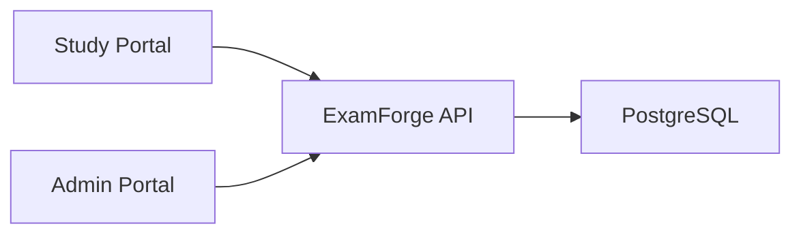

# ExamForge

ExamForge is a full-stack exam preparation platform for creating, taking, and reviewing exams.

It consists of a Study Portal, an Admin Portal to manage exam's content, and a .NET 10 API with a PostgreSQL Database.

[Open the public preview](https://examforge.io.vn)

> [!NOTE]
> ExamForge is in pre-production and approaching its first stable release. The public preview demonstrates the current product, but features and API contracts may still change.

## Features

### Study Portal

* Browse and filter published exams
* Take exams in practice or timed exam mode
* Save answers during an active attempt
* Automatically submit timed attempts when time expires
* Review scores, answers, solutions, and explanations
* View attempt history and performance statistics
* Render formatted content, LaTeX, tables, and code blocks
* Multi-language (vi, en)

### Admin Portal

* Manage exams, versions, sections, and questions
* Organize content with tags and categories
* Create formatted question content with rich-text and LaTeX support
* Publish, retire, archive, and restore content
* Inspect users and exam attempts
* Review administrative activity through audit events

### API

* JWT authentication with refresh-token support
* Role-based authorization for student and admin operations
* Exam, attempt, user, and statistics APIs
* PostgreSQL persistence through Entity Framework Core
* Structured JSON logging with correlation IDs
* Global and authentication rate limiting
* Liveness and database readiness health checks
* Production hosting behind a trusted reverse proxy

## Architecture



The Study and Admin portals are separate Next.js applications. Both use the same ASP.NET Core API, which owns authentication, authorization, business rules, grading, and persistence.

## Technology

| Area                | Technology                                     |
| ------------------- | ---------------------------------------------- |
| Backend             | .NET 10, ASP.NET Core, Entity Framework Core   |
| Frontend            | Next.js 16, React 19, TypeScript, Tailwind CSS |
| Database            | PostgreSQL                                     |
| Client data         | TanStack Query, Axios, Zustand, Zod            |
| Testing             | xUnit, Vitest, Testing Library, MSW            |
| Infrastructure      | Docker, GitHub Actions, Nginx                  |
| Production database | Neon PostgreSQL                                |

## Repository structure

```text
.
├─ .github/
│  └─ workflows/
├─ apps/
│  ├─ examforge-admin/
│  ├─ examforge-api/
│  └─ examforge-study/
├─ docs/
├─ docker-compose.yml
├─ docker-compose.production.yml
└─ README.md
```

Detailed setup and implementation notes:

* [ExamForge API](apps/examforge-api/README.md)
* [ExamForge Study Portal](apps/examforge-study/README.md)
* [Project documentation](docs/)

## Local development

### Prerequisites

* Docker with the Compose plugin
* Node.js 24 and npm
* Access to a PostgreSQL database

The local Compose configuration runs the API and its migrations. It does not start a PostgreSQL container.

### 1. Configure and start the API

From the repository root:

```bash
cp .env.example .env
```

Update `.env` with a PostgreSQL connection string and a cryptographically generated JWT secret.

```bash
openssl rand -base64 32
docker compose up --build
```

The API will be available at:

* API: `http://localhost:5001`
* Swagger UI: `http://localhost:5001/swagger`
* Liveness: `http://localhost:5001/health/live`
* Readiness: `http://localhost:5001/health/ready`

Swagger and OpenAPI are enabled only in the Development environment.

### 2. Start the Study Portal

In a second terminal:

```bash
cd apps/examforge-study
cp .env.example .env.local
npm ci
npm run dev
```

Open `http://localhost:3000`.

The default Study configuration expects the API at `http://localhost:5001`.

## Verification

### API

```bash
cd apps/examforge-api
dotnet restore ExamForge.slnx
dotnet build ExamForge.slnx --no-restore
dotnet test ExamForge.slnx --no-build
```

### Study Portal

```bash
cd apps/examforge-study
npm ci
npm run check
```

The Study `check` script runs linting, type checking, tests, legal-content validation, and a production build.

## Deployment

The public preview is available at [examforge.io.vn](https://examforge.io.vn).

The API is packaged as Docker images, deployed behind a TLS-terminating reverse proxy, and exposed at `https://api.examforge.io.vn`. Production deployments run database migrations before replacing the API container and verify the readiness endpoint before completing.

Production secrets and environment-specific configuration are not stored in the repository.

## Status

ExamForge is currently a pre-production project. The main workflows are implemented and deployed for preview, while testing, documentation, operational hardening, and release preparation continue.

## License

ExamForge is available under the [MIT License](LICENSE).
