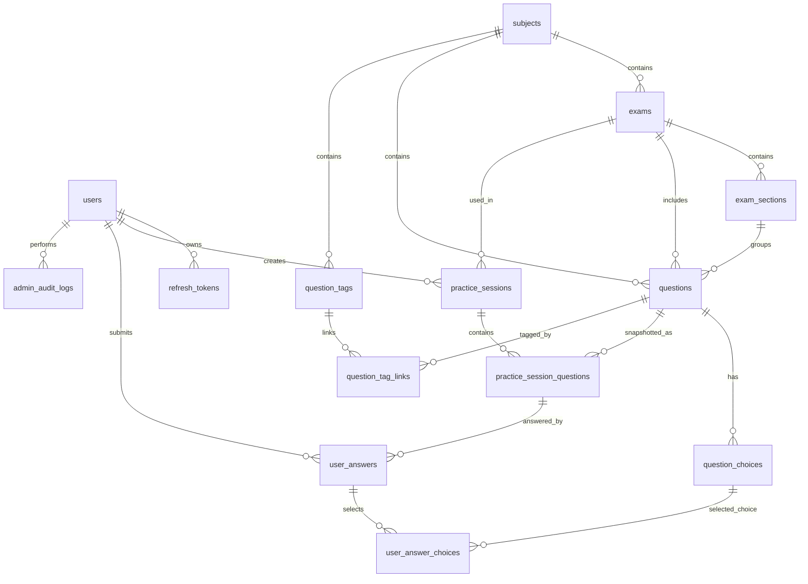
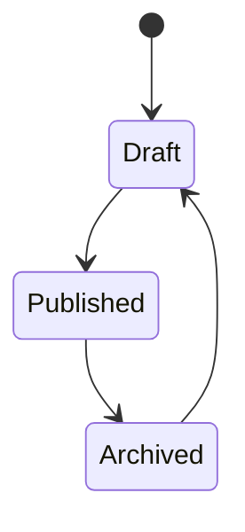
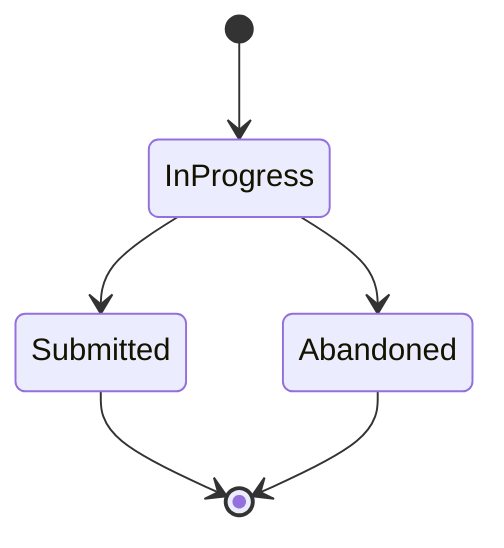

# ExamForge Database Design

## 1. Database Overview

ExamForge uses PostgreSQL as the primary relational database.

The schema is designed around these core areas:

1. Identity and authorization.
2. Subject and exam content.
3. Question bank.
4. Practice sessions and answers.
5. User progress.
6. Admin auditing.

For MVP, the database should remain normalized and explicit. Avoid storing core relationships only in JSONB because the platform needs filtering, scoring, analytics, and content management.

## 2. Design Principles

- Use UUID primary keys.
- Use `created_at` and `updated_at` on main tables.
- Use `deleted_at` only when soft delete is needed.
- Prefer archive/status fields for content lifecycle.
- Use foreign keys for relational integrity.
- Use indexes on foreign keys and frequently filtered fields.
- Store correct answers on the server only.
- Store practice session snapshots where needed to preserve review history after questions are edited.

## 3. Entity Relationship Diagram



## 4. Enum Types

Recommended enums can be implemented as PostgreSQL enums or string columns with check constraints. For EF Core simplicity, string columns with check constraints are acceptable.

### User Role

```txt
Student
Admin
```

### Content Status

```txt
Draft
Published
Archived
```

### Question Type

```txt
SingleChoice
MultipleChoice
```

Future types:

```txt
TrueFalse
TextInput
Ordering
Matching
Essay
```

### Difficulty

```txt
Easy
Medium
Hard
```

### Practice Session Status

```txt
InProgress
Submitted
Abandoned
```

### Practice Mode

```txt
Practice
MockExam
```

MVP may implement only `Practice`.

## 5. Tables

## 5.1 `users`

If ASP.NET Core Identity is used, this table may be replaced by Identity's default tables. If using a custom lightweight auth system, use this structure.

| Column | Type | Constraints | Notes |
|---|---|---|---|
| `id` | uuid | PK | User ID. |
| `email` | varchar(320) | unique, not null | Normalized email recommended. |
| `password_hash` | text | not null | Never expose through API. |
| `display_name` | varchar(120) | not null | User-facing name. |
| `role` | varchar(30) | not null | `Student` or `Admin`. |
| `created_at` | timestamptz | not null | Creation time. |
| `updated_at` | timestamptz | not null | Last update time. |

Indexes:

```sql
CREATE UNIQUE INDEX ux_users_email ON users (lower(email));
CREATE INDEX ix_users_role ON users (role);
```

## 5.2 `refresh_tokens`

| Column | Type | Constraints | Notes |
|---|---|---|---|
| `id` | uuid | PK | Token ID. |
| `user_id` | uuid | FK -> users.id, not null | Owner. |
| `token_hash` | text | not null | Store hash, not raw token. |
| `expires_at` | timestamptz | not null | Expiration time. |
| `revoked_at` | timestamptz | nullable | Set when revoked. |
| `created_at` | timestamptz | not null | Creation time. |

Indexes:

```sql
CREATE INDEX ix_refresh_tokens_user_id ON refresh_tokens (user_id);
CREATE INDEX ix_refresh_tokens_expires_at ON refresh_tokens (expires_at);
```

## 5.3 `subjects`

| Column | Type | Constraints | Notes |
|---|---|---|---|
| `id` | uuid | PK | Subject ID. |
| `name` | varchar(120) | not null | Example: English, Math. |
| `slug` | varchar(140) | unique, not null | Public URL identifier. |
| `description` | text | nullable | Subject description. |
| `status` | varchar(30) | not null | Draft, Published, Archived. |
| `created_at` | timestamptz | not null | Creation time. |
| `updated_at` | timestamptz | not null | Last update time. |

Indexes:

```sql
CREATE UNIQUE INDEX ux_subjects_slug ON subjects (slug);
CREATE INDEX ix_subjects_status ON subjects (status);
```

## 5.4 `exams`

| Column | Type | Constraints | Notes |
|---|---|---|---|
| `id` | uuid | PK | Exam ID. |
| `subject_id` | uuid | FK -> subjects.id, not null | Parent subject. |
| `title` | varchar(200) | not null | Exam title. |
| `slug` | varchar(220) | not null | Unique within subject. |
| `description` | text | nullable | Exam description. |
| `duration_minutes` | integer | nullable | Optional for practice mode. |
| `status` | varchar(30) | not null | Draft, Published, Archived. |
| `created_at` | timestamptz | not null | Creation time. |
| `updated_at` | timestamptz | not null | Last update time. |

Constraints:

```sql
ALTER TABLE exams ADD CONSTRAINT ck_exams_duration_positive
CHECK (duration_minutes IS NULL OR duration_minutes > 0);
```

Indexes:

```sql
CREATE UNIQUE INDEX ux_exams_subject_slug ON exams (subject_id, slug);
CREATE INDEX ix_exams_subject_id ON exams (subject_id);
CREATE INDEX ix_exams_status ON exams (status);
```

## 5.5 `exam_sections`

| Column | Type | Constraints | Notes |
|---|---|---|---|
| `id` | uuid | PK | Section ID. |
| `exam_id` | uuid | FK -> exams.id, not null | Parent exam. |
| `title` | varchar(200) | not null | Section title. |
| `description` | text | nullable | Optional section description. |
| `order_index` | integer | not null | Display order. |
| `created_at` | timestamptz | not null | Creation time. |
| `updated_at` | timestamptz | not null | Last update time. |

Indexes:

```sql
CREATE UNIQUE INDEX ux_exam_sections_order ON exam_sections (exam_id, order_index);
CREATE INDEX ix_exam_sections_exam_id ON exam_sections (exam_id);
```

## 5.6 `questions`

| Column | Type | Constraints | Notes |
|---|---|---|---|
| `id` | uuid | PK | Question ID. |
| `subject_id` | uuid | FK -> subjects.id, not null | Subject. |
| `exam_id` | uuid | FK -> exams.id, nullable | Nullable later for global bank; required for MVP practice flow. |
| `section_id` | uuid | FK -> exam_sections.id, nullable | Section grouping. |
| `type` | varchar(40) | not null | SingleChoice, MultipleChoice. |
| `prompt` | text | not null | Main question content. |
| `explanation` | text | nullable | Shown after submission. |
| `difficulty` | varchar(30) | not null | Easy, Medium, Hard. |
| `order_index` | integer | nullable | Order inside section/exam. |
| `status` | varchar(30) | not null | Draft, Published, Archived. |
| `created_at` | timestamptz | not null | Creation time. |
| `updated_at` | timestamptz | not null | Last update time. |

Indexes:

```sql
CREATE INDEX ix_questions_subject_id ON questions (subject_id);
CREATE INDEX ix_questions_exam_id ON questions (exam_id);
CREATE INDEX ix_questions_section_id ON questions (section_id);
CREATE INDEX ix_questions_status ON questions (status);
CREATE INDEX ix_questions_type ON questions (type);
CREATE INDEX ix_questions_difficulty ON questions (difficulty);
```

Important validation should be handled at the application layer:

- Published choice-based question must have at least two choices.
- `SingleChoice` question must have exactly one correct choice.
- `MultipleChoice` question must have at least one correct choice.

## 5.7 `question_choices`

| Column | Type | Constraints | Notes |
|---|---|---|---|
| `id` | uuid | PK | Choice ID. |
| `question_id` | uuid | FK -> questions.id, not null | Parent question. |
| `content` | text | not null | Choice text. |
| `is_correct` | boolean | not null | Correct answer flag. |
| `order_index` | integer | not null | Display order. |
| `created_at` | timestamptz | not null | Creation time. |
| `updated_at` | timestamptz | not null | Last update time. |

Indexes:

```sql
CREATE INDEX ix_question_choices_question_id ON question_choices (question_id);
CREATE UNIQUE INDEX ux_question_choices_order ON question_choices (question_id, order_index);
```

## 5.8 `question_tags`

| Column | Type | Constraints | Notes |
|---|---|---|---|
| `id` | uuid | PK | Tag ID. |
| `subject_id` | uuid | FK -> subjects.id, not null | Parent subject. |
| `name` | varchar(120) | not null | Tag name. |
| `slug` | varchar(140) | not null | Tag slug. |
| `created_at` | timestamptz | not null | Creation time. |
| `updated_at` | timestamptz | not null | Last update time. |

Indexes:

```sql
CREATE UNIQUE INDEX ux_question_tags_subject_slug ON question_tags (subject_id, slug);
CREATE INDEX ix_question_tags_subject_id ON question_tags (subject_id);
```

## 5.9 `question_tag_links`

| Column | Type | Constraints | Notes |
|---|---|---|---|
| `question_id` | uuid | PK, FK -> questions.id | Linked question. |
| `tag_id` | uuid | PK, FK -> question_tags.id | Linked tag. |

Indexes:

```sql
CREATE INDEX ix_question_tag_links_tag_id ON question_tag_links (tag_id);
```

## 5.10 `practice_sessions`

| Column | Type | Constraints | Notes |
|---|---|---|---|
| `id` | uuid | PK | Session ID. |
| `user_id` | uuid | FK -> users.id, not null | Owner. |
| `exam_id` | uuid | FK -> exams.id, not null | Exam practiced. |
| `mode` | varchar(30) | not null | Practice or MockExam. |
| `status` | varchar(30) | not null | InProgress, Submitted, Abandoned. |
| `started_at` | timestamptz | not null | Start time. |
| `submitted_at` | timestamptz | nullable | Submission time. |
| `total_questions` | integer | nullable | Snapshot after submission. |
| `correct_count` | integer | nullable | Snapshot after submission. |
| `score_percent` | numeric(5,2) | nullable | Snapshot after submission. |
| `created_at` | timestamptz | not null | Creation time. |
| `updated_at` | timestamptz | not null | Last update time. |

Constraints:

```sql
ALTER TABLE practice_sessions ADD CONSTRAINT ck_practice_sessions_score_range
CHECK (score_percent IS NULL OR (score_percent >= 0 AND score_percent <= 100));
```

Indexes:

```sql
CREATE INDEX ix_practice_sessions_user_id ON practice_sessions (user_id);
CREATE INDEX ix_practice_sessions_exam_id ON practice_sessions (exam_id);
CREATE INDEX ix_practice_sessions_status ON practice_sessions (status);
CREATE INDEX ix_practice_sessions_submitted_at ON practice_sessions (submitted_at DESC);
```

## 5.11 `practice_session_questions`

This table snapshots which questions are included in a session and in what order.

| Column | Type | Constraints | Notes |
|---|---|---|---|
| `id` | uuid | PK | Session question ID. |
| `practice_session_id` | uuid | FK -> practice_sessions.id, not null | Parent session. |
| `question_id` | uuid | FK -> questions.id, not null | Original question. |
| `order_index` | integer | not null | Question order in session. |
| `prompt_snapshot` | text | not null | Prompt at session creation. |
| `explanation_snapshot` | text | nullable | Explanation at session creation. |
| `question_type_snapshot` | varchar(40) | not null | Type at session creation. |

Indexes:

```sql
CREATE INDEX ix_practice_session_questions_session_id
ON practice_session_questions (practice_session_id);

CREATE UNIQUE INDEX ux_practice_session_questions_order
ON practice_session_questions (practice_session_id, order_index);
```

Why snapshots are useful:

- Admins may edit questions later.
- Learners should review the version they actually answered.
- Score history remains stable.

## 5.12 `practice_session_choice_snapshots`

Recommended if you want review history to remain fully stable even after choices are edited.

| Column | Type | Constraints | Notes |
|---|---|---|---|
| `id` | uuid | PK | Snapshot choice ID. |
| `practice_session_question_id` | uuid | FK -> practice_session_questions.id, not null | Parent session question. |
| `original_choice_id` | uuid | FK -> question_choices.id, nullable | Original choice. |
| `content_snapshot` | text | not null | Choice content at session creation. |
| `is_correct_snapshot` | boolean | not null | Correctness at session creation. |
| `order_index` | integer | not null | Display order. |

Indexes:

```sql
CREATE INDEX ix_choice_snapshots_session_question_id
ON practice_session_choice_snapshots (practice_session_question_id);
```

For a smaller MVP, this table can be skipped initially, but it is recommended for correctness.

## 5.13 `user_answers`

| Column | Type | Constraints | Notes |
|---|---|---|---|
| `id` | uuid | PK | Answer ID. |
| `user_id` | uuid | FK -> users.id, not null | Answer owner. |
| `practice_session_id` | uuid | FK -> practice_sessions.id, not null | Parent session. |
| `practice_session_question_id` | uuid | FK -> practice_session_questions.id, not null | Answered question. |
| `is_correct` | boolean | nullable | Set after submission. |
| `answered_at` | timestamptz | not null | Last answer time. |
| `created_at` | timestamptz | not null | Creation time. |
| `updated_at` | timestamptz | not null | Last update time. |

Indexes:

```sql
CREATE UNIQUE INDEX ux_user_answers_session_question
ON user_answers (practice_session_id, practice_session_question_id);

CREATE INDEX ix_user_answers_user_id ON user_answers (user_id);
CREATE INDEX ix_user_answers_practice_session_id ON user_answers (practice_session_id);
```

## 5.14 `user_answer_choices`

| Column | Type | Constraints | Notes |
|---|---|---|---|
| `user_answer_id` | uuid | PK, FK -> user_answers.id | Parent answer. |
| `choice_id` | uuid | PK, FK -> question_choices.id | Selected choice. |

If using choice snapshots, replace `choice_id` with `choice_snapshot_id` referencing `practice_session_choice_snapshots.id`.

## 5.15 `bookmarks`

Optional for MVP. Useful for later learner retention.

| Column | Type | Constraints | Notes |
|---|---|---|---|
| `id` | uuid | PK | Bookmark ID. |
| `user_id` | uuid | FK -> users.id, not null | Owner. |
| `question_id` | uuid | FK -> questions.id, not null | Bookmarked question. |
| `created_at` | timestamptz | not null | Creation time. |

Indexes:

```sql
CREATE UNIQUE INDEX ux_bookmarks_user_question ON bookmarks (user_id, question_id);
CREATE INDEX ix_bookmarks_user_id ON bookmarks (user_id);
```

## 5.16 `admin_audit_logs`

Recommended for admin operations. Can be added after basic MVP if time is limited.

| Column | Type | Constraints | Notes |
|---|---|---|---|
| `id` | uuid | PK | Log ID. |
| `admin_user_id` | uuid | FK -> users.id, not null | Actor. |
| `action` | varchar(120) | not null | Example: `QuestionPublished`. |
| `entity_type` | varchar(120) | not null | Example: `Question`. |
| `entity_id` | uuid | nullable | Target entity. |
| `metadata` | jsonb | nullable | Extra context. |
| `created_at` | timestamptz | not null | Action time. |

Indexes:

```sql
CREATE INDEX ix_admin_audit_logs_admin_user_id ON admin_audit_logs (admin_user_id);
CREATE INDEX ix_admin_audit_logs_entity ON admin_audit_logs (entity_type, entity_id);
CREATE INDEX ix_admin_audit_logs_created_at ON admin_audit_logs (created_at DESC);
```

## 6. Scoring Logic

### 6.1 Single Choice

A single-choice answer is correct when:

```txt
selected choice count = 1
AND selected choice is the correct choice
```

### 6.2 Multiple Choice

A multiple-choice answer is correct when:

```txt
selected choice set exactly equals correct choice set
```

For MVP, avoid partial scoring. Partial scoring can be introduced later.

### 6.3 Score Percent

```txt
score_percent = correct_count / total_questions * 100
```

Store `correct_count`, `total_questions`, and `score_percent` on `practice_sessions` after submission.

## 7. Data Lifecycle

### 7.1 Question Lifecycle



Rules:

- Only `Published` questions are visible to learners.
- `Draft` questions are only visible in Admin Portal.
- `Archived` questions should not appear in new sessions.
- Existing submitted sessions should still be reviewable.

### 7.2 Practice Session Lifecycle



Rules:

- Answers can be changed only while session status is `InProgress`.
- Score is calculated only once when transitioning to `Submitted`.
- Submitted sessions are immutable from the learner perspective.

## 8. Seed Data

Recommended MVP seed data:

- Admin user.
- Student demo user.
- 2 subjects.
- 2 exams per subject.
- 2 sections per exam.
- 10 questions per exam.
- Choices and explanations for all seeded questions.

Example subjects:

```txt
English
Mathematics
```

Example exams:

```txt
IELTS Reading Practice Set 1
Basic Algebra Practice Set 1
```

## 9. Migration Plan

### Initial Migration

- Users/auth tables.
- Subjects.
- Exams.
- Exam sections.
- Questions.
- Question choices.
- Question tags.
- Practice sessions.
- Practice session questions.
- User answers.
- User answer choices.

### Later Migrations

- Bookmarks.
- Admin audit logs.
- Choice snapshots if skipped initially.
- Import job tables.
- Analytics summary tables.
- Subscription tables if monetization is added.

## 10. EF Core Implementation Notes

### Recommended Entity Rules

- Use `Guid` for IDs.
- Configure table names explicitly in `OnModelCreating`.
- Configure max lengths explicitly.
- Configure relationships explicitly.
- Configure delete behavior carefully.
- Avoid cascade delete on important content tables if accidental deletion would damage history.

### Delete Behavior Recommendation

| Relationship | Delete Behavior |
|---|---|
| Subject -> Exams | Restrict or soft archive. |
| Exam -> Sections | Restrict if questions exist. |
| Question -> Choices | Cascade is acceptable for draft questions. Be careful after publication. |
| User -> Practice Sessions | Restrict. |
| Practice Session -> User Answers | Cascade is acceptable only if deleting sessions is allowed. Prefer no deletion. |

## 11. Query Patterns to Support

### Study Portal

- List published subjects.
- List published exams by subject.
- Load published questions for an exam.
- Load current user's practice sessions.
- Load current user's progress summary.

### Admin Portal

- List questions by subject/exam/status.
- Search questions by prompt text.
- Count questions by status.
- List exams by subject/status.
- Find invalid draft questions before publishing.

## 12. Performance Notes

For MVP, basic indexes are enough. Do not prematurely add caching or complex read models.

Add caching later only if:

- Subject/exam browsing becomes slow.
- Question loading becomes slow.
- Public content is mostly static.

Potential future optimizations:

- Materialized views for analytics.
- Read-optimized progress summaries.
- Redis cache for published subjects/exams.
- Background jobs for large import or analytics tasks.

## 13. Open Design Decisions

| Decision | MVP Recommendation |
|---|---|
| ASP.NET Identity or custom users? | Use ASP.NET Identity if you want production realism; use custom auth if you want faster learning/control. |
| Store question content as plain text or rich text? | Start with plain text or Markdown. Add rich text later. |
| Allow questions without exams? | Allow later; for MVP, require exam assignment for practice flow. |
| Snapshot choices? | Recommended for correctness; can be skipped for faster MVP. |
| Partial scoring for multiple choice? | Skip for MVP. Use exact-match scoring. |

